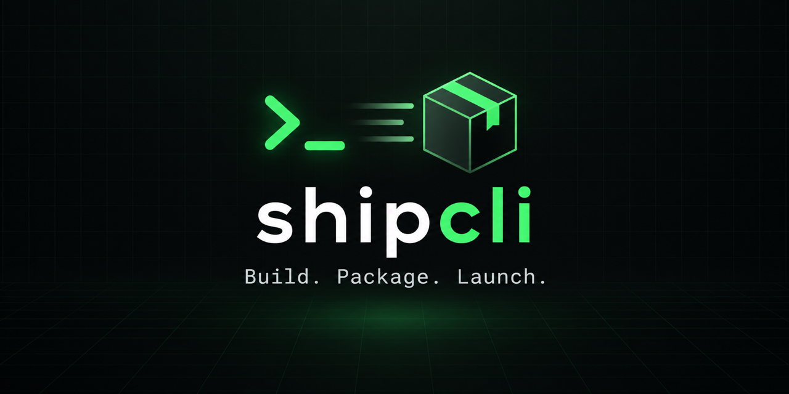

# shipcli

[](https://github.com/lackim/shipcli/actions/workflows/ci.yml)
[](https://www.npmjs.com/package/@shipcli/cli)
[](https://nodejs.org/)
[](LICENSE)



Build, package, and launch command-line products from one TypeScript toolkit.

[Read the documentation](https://lackim.github.io/shipcli/docs) or start with the
generator below.

> **Project status:** early access (`0.x`). The public API may change between minor
> releases. Feedback and focused contributions are welcome.

shipcli combines a small CLI framework with scaffolding and distribution tools.
Use only the packages you need, or install the orchestrator to get the complete
workflow.

## Quick start

Create a new CLI:

```bash
npx @shipcli/create my-cli
cd my-cli
npm start -- --help
```

Or install the shipcli workflow globally:

```bash
npm install --global @shipcli/cli
shipcli --help
```

Requirements: Node.js 24 or newer for this repository and all published
packages. Binary builds additionally require
[Bun](https://bun.sh/).

The generator initializes git and installs dependencies by default. Use
`--no-git` or `--no-install` when you want to handle those steps yourself.

## What it provides

- A Commander-based CLI foundation with consistent output, configuration,
  spinners, error handling, and update checks.
- A starter generator that produces a small, publishable TypeScript CLI.
- Release helpers for npm, standalone Bun binaries, Homebrew formulae, and
  changelogs.
- Share-card generation powered by Satori and Resvg.
- A Next.js landing-page starter with a terminal demo.

## Commands

```text
shipcli init [name]       Scaffold a new CLI project
shipcli publish           Bump the version, create a tag, and publish to npm
shipcli build             Build cross-platform binaries with Bun
shipcli homebrew          Generate a Homebrew formula
shipcli changelog         Generate CHANGELOG.md from git history
shipcli landing init      Scaffold a Next.js landing page
```

Run `shipcli <command> --help` for all options. Before a real release, use
`shipcli publish --dry-run`; it performs npm's package check without modifying
`package.json`, commits, or tags.

`shipcli init` accepts `--description`, `--no-git`, and `--no-install`.
`shipcli landing init` accepts `--out-dir` when the default `web/` directory is
not appropriate.

## Project configuration

Generated projects include a typed `shipcli.config.ts`. It keeps repeatable
defaults in the repository while explicit command-line options remain the final
override.

```ts
import { defineConfig } from "@shipcli/core";

export default defineConfig({
  name: "my-cli",
  description: "A useful command-line tool",
  build: {
    entrypoint: "./src/cli.ts",
    outDir: "dist",
    targets: ["macos-arm64", "linux-x64"],
  },
  publish: { access: "public", bump: "patch" },
  share: { enabled: true },
  landing: { outDir: "web" },
});
```

## Packages

| Package | Purpose |
| --- | --- |
| [`@shipcli/core`](https://www.npmjs.com/package/@shipcli/core) | CLI primitives: commands, output, config, spinners, and update checks |
| [`@shipcli/create`](https://www.npmjs.com/package/@shipcli/create) | Project generator used by `npx @shipcli/create` |
| [`@shipcli/cli`](https://www.npmjs.com/package/@shipcli/cli) | Top-level `shipcli` command |
| [`@shipcli/build`](https://www.npmjs.com/package/@shipcli/build) | npm, binary, Homebrew, and changelog helpers |
| [`@shipcli/share`](https://www.npmjs.com/package/@shipcli/share) | Open Graph image generation |
| [`@shipcli/landing`](https://www.npmjs.com/package/@shipcli/landing) | Next.js landing-page scaffolding |

The packages are authored in strict TypeScript and published as ESM JavaScript
with TypeScript declarations and source maps.

## Example

```ts
#!/usr/bin/env node

import { createCLI } from "@shipcli/core";
import { success } from "@shipcli/core/output";

const cli = createCLI({
  name: "hello-cli",
  packageName: "hello-cli",
  description: "A friendly example CLI",
  version: "1.0.0",
});

cli
  .argument("[name]", "Name to greet", "world")
  .action((name) => success(`Hello, ${name}!`));

await cli.run();
```

## Development

This repository is a pnpm monorepo.

For a compact, runnable reference project, see
[`examples/hello-cli`](examples/hello-cli).

```bash
git clone https://github.com/lackim/shipcli.git
cd shipcli
corepack enable
pnpm install --frozen-lockfile
pnpm check
```

Useful commands:

```bash
pnpm test        # Run the Node.js test suite
pnpm lint        # Check all source files
pnpm typecheck   # Build packages and verify TypeScript
pnpm build       # Build packages and documentation website
pnpm build:web   # Build the documentation website
pnpm dev:web     # Run the website locally
```

See [CONTRIBUTING.md](CONTRIBUTING.md) before opening a pull request. Security
issues should follow the private process in [SECURITY.md](SECURITY.md).

## Built with shipcli

- [codeautopsy](https://github.com/lackim/codeautopsy) — post-mortem analysis of inactive GitHub repositories
- [saas-autopsy](https://github.com/lackim/saas-autopsy) — SaaS health analysis powered by TrustMRR

## License

Released under the [MIT License](LICENSE).
